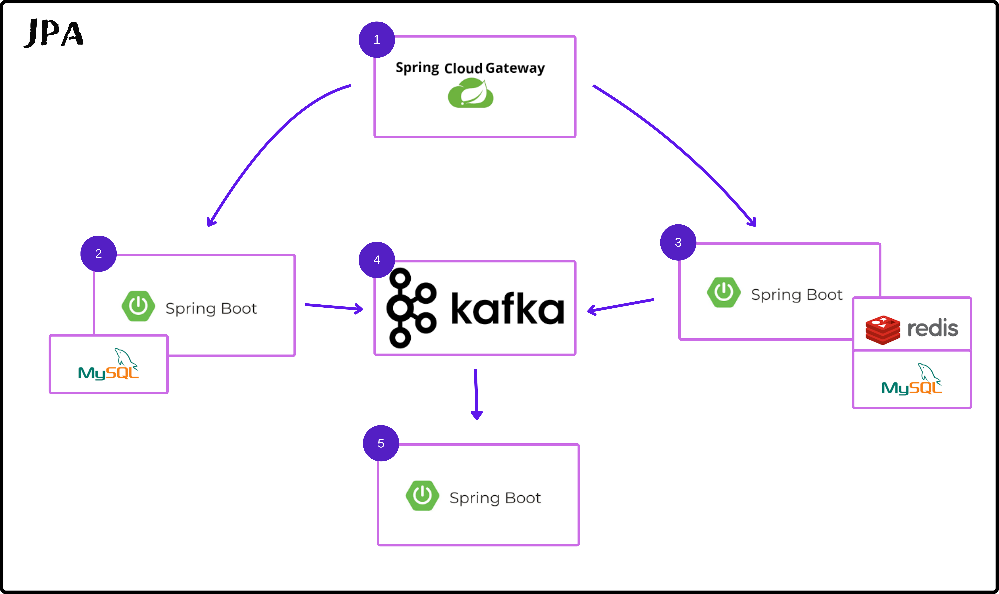
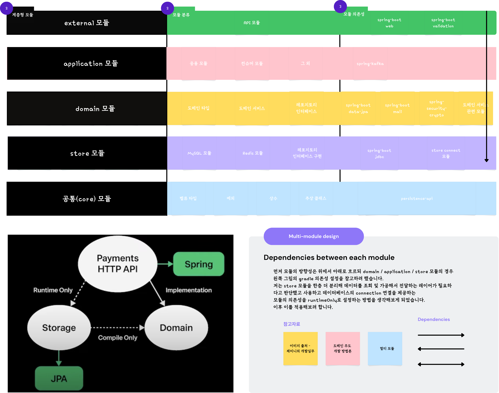
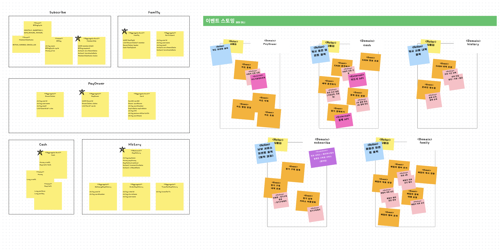

<p style="font-family: 'Courier New', monospace; font-size: 20px;">핀테크 서비스 플랫폼 BE</p>
<p style="font-family: 'Courier New', monospace; font-size: 15px;">Spring JPA를 이용한 MSA 환경의 플랫폼 서비스입니다.</p>


<p style="font-style: italic; color: gray;">
<div class="feature" style="padding: 15px; margin-bottom: 15px; background-color: #f1f8ff; border-left: 4px solid #0366d6; border-radius: 4px;">
  <strong>비고: 25.03.12: 레디스는 추후 도입 예정입니다.</strong>
</div>

<div class="container" style="background-color: white; padding: 30px; border-radius: 8px; box-shadow: 0 2px 10px rgba(0, 0, 0, 0.1);">
  <h1 style="color: #2c3e50; margin-bottom: 20px; border-bottom: 2px solid #eaeaea; padding-bottom: 10px;">인증 / 회원 애플리케이션</h1>
  <div class="description" style="font-size: 16px; margin-bottom: 25px; color: #555;">
    회원을 관리하고 인증을 제공하는 애플리케이션입니다. <br>
  </div>
  <div class="feature" style="padding: 15px; margin-bottom: 15px; background-color: #f1f8ff; border-left: 4px solid #0366d6; border-radius: 4px;">
    <strong>기능:</strong> 회원 관리 / 인증 / 토큰 발행 및 재발행 / 인증 메일 관리
  </div>
  <div class="tech-stack" style="display: flex; flex-wrap: wrap; gap: 15px; margin-top: 25px;">
    
    
    
    
    
    
  </div>

  <h1 style="color: #2c3e50; margin-bottom: 20px; border-bottom: 2px solid #eaeaea; padding-bottom: 10px;">페이 애플리케이션</h1>
  <div class="description" style="font-size: 16px; margin-bottom: 25px; color: #555;">
    플랫폼이 제공하는 서비스를 이용하거나 구매하기 위한 온라인 재화를 충전하거나 그룹 단위로 결제 상품을 관리할 수 있습니다. <br>
  </div>
  <div class="feature" style="padding: 15px; margin-bottom: 15px; background-color: #f1f8ff; border-left: 4px solid #0366d6; border-radius: 4px;">
    <strong>기능:</strong> 플랫폼이 발행한 결제 카드 / 결제(캐시 충전) 이벤트 발행 / 공유 캐시 그룹의 이벤트 발행(초대, 상품 결제 요청)
  </div>
  <div class="tech-stack" style="display: flex; flex-wrap: wrap; gap: 15px; margin-top: 25px;">
    
    
    
    
    
    
  </div>

  <h1 style="color: #2c3e50; margin-bottom: 20px; border-bottom: 2px solid #eaeaea; padding-bottom: 10px;">게이트웨이 애플리케이션</h1>
  <div class="description" style="font-size: 16px; margin-bottom: 25px; color: #555;">
    사용자의 인증 및 인가를 담당하고 적절한 API 호출이 이루어질 수 있도록 API 애플리케이션 서비스로의 라우팅을 담당하고 있습니다.
  </div>
  <div class="feature" style="padding: 15px; margin-bottom: 15px; background-color: #f1f8ff; border-left: 4px solid #0366d6; border-radius: 4px;">
    <strong>특징:</strong> 비동기로 사용자의 요청을 처리할 수 있도록 스프링 게이트웨이를 활용한 스프링 부트 환경에서 WebFlux 기술을 이용했습니다.
  </div>
  <div class="tech-stack" style="display: flex; flex-wrap: wrap; gap: 15px; margin-top: 25px;">
    
    
    
    
  </div>

  <h1 style="color: #2c3e50; margin-bottom: 20px; border-bottom: 2px solid #eaeaea; padding-bottom: 10px;">플랫폼 컨슈머 애플리케이션</h1>
  <div class="description" style="font-size: 16px; margin-bottom: 25px; color: #555;">
    플랫폼 내에서 발생하는 카프카 메시지(이벤트)를 처리하는 애플리케이션입니다. 이벤트 구분 및 범위에 따라 플랫폼에서 사용하는 데이터베이스들에 접근할 수 있도록 데이터소스 및 트랜잭션을 구분하고 설정할 수 있도록 했습니다. <br>
  </div>
  <div class="feature" style="padding: 15px; margin-bottom: 15px; background-color: #f1f8ff; border-left: 4px solid #0366d6; border-radius: 4px;">
    <strong>특징:</strong> 이벤트는 크게 계정 / 결제 / 구매 / 계정 그룹 이벤트로 나누어볼 수 있고 애플리케이션이 적절하게 이벤트를 처리합니다.
  </div>
  <div class="tech-stack" style="display: flex; flex-wrap: wrap; gap: 15px; margin-top: 25px;">
    
    
    
    
  </div>

  <h1 style="color: #2c3e50; margin-bottom: 20px; border-bottom: 2px solid #eaeaea; padding-bottom: 10px;">멀티모듈 프로젝트와 개발 환경</h1>
  <div class="description" style="font-size: 16px; margin-bottom: 25px; color: #555;">
  </div>
  <h3 style="color: black">데이터 저장소</h3>
  <div class="tech-stack" style="display: flex; flex-wrap: wrap; gap: 15px; margin-top: 25px;">
    
    
    
  </div>

  <h3 style="color: black">개발 환경</h3>
  <div class="tech-stack" style="display: flex; flex-wrap: wrap; gap: 15px; margin-top: 25px;">
    
    
    
  </div>
</div>

## 멀티 모듈 구성



|         모듈         | 설명                                                                                       |
|:------------------:|:-----------------------------------------------------------------------------------------|
|     **api 모듈**     | **외부에 공개되는 엔드 포인트를 제공하는 모듈들**                                                            |
| **application 모듈** | **애플리케이션 모듈로써 도메인 모듈의 다양한 도메인 서비스를 한 곳에 모아 실행할 수 있는 영역<br/>(ex. 컨슈머 모듈)**                |
|   **domain 모듈**    | **도메인이 필요한 오브젝트와 밸류타입, 그리고 도메인이 제공하는 기능을 수행할 수 있도록 도메인 서비스**                             |
|    **store 모듈**    | **데이터 저장소의 connection에 대한 설정과 레포지토리의 구현체**                                               |
|    **core 모듈**     | **다양한 모듈들이 공유하는 공통 모듈로써 밸류 타입, 예외, 인터페이스 등. 최대한 POJO와 가깝게 작성하려 노력을 많이 기울였던 모듈**          |
|   **실행 가능한 모듈**    | **:bank-api:techfin-user, bank-api:techfin-pay, bank-application:techfin-core-consumer** |

### 모듈 설정 및 실행
```bash

# 의존성 체크 후 실행 가능한 모듈 실행 예시
./gradlew clean
./gradlew :bank-api:techfin-user-api:build --refresh-dependencies
./gradlew :bank-api:techfin-pay-api:build --refresh-dependencies

# 실행 환경에 맞춰 데이터 소스를 로드할 수 있도록 profile 설정
profile: {"production", "develop", "test"}

# 리팩토링 이후 redis를 제거하며 제거된 기능에 대해서는 릴리즈에서 Mock을 활용한 임시 객체로 작성
```

## 참고 자료 및 일정 관리
- **페이 애플리케이션 개발 전 이벤트 스토밍**
-
- **일정 참고 자료**
  - 👉🏻 [개발 일지](https://www.notion.so/Techfin-10a86943310e80059e4cc4fd8f2f5d44#15186943310e80b59f85dc5f763a333a)
  - 비고: 현재 개발 내용과 상이한 부분이 있을 수 있습니다. (+ github을 이용한 일정 관리)